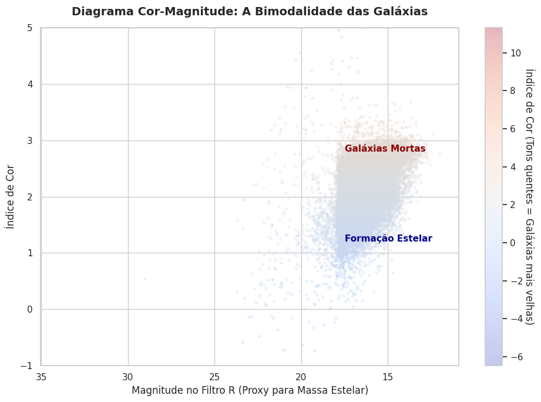

# Relatório

> [!CAUTION]
>
> - Você <ins>**não pode utilizar ferramentas de IA para escrever este relatório**</ins>.

## Identificação

- **Nome**: <mark>`Guilherme Martins Mulazzani`</mark>
- **Cartão UFRGS:** <mark>`00597915`</mark>

## Dados utilizados

> [!IMPORTANT]
>
> - Os dados utilizados devem ser informados como **links** para as fontes originais.
> - Se houver mais de um conjunto de dados, liste todos separadamente.
> - Para cada conjunto de dados, inclua também uma **descrição curta** explicando os dados.

1. **SDSS DR17 (Sky Server)**: <mark>`http://skyserver.sdss.org/dr17/SkyServerWS/SearchTools/SqlSearch`</mark>
    * **Descrição curta**: <mark>`O DR17 foi o último lançamento da quarta fase do SDSS, fazendo o mapeamento com dados de imagem e espectroscopia óptica e infravermelha para milhões de alvo. Esta base conta com mais de 1,2 bilhão de objetos catalogados e mais de 5,7 milhões de espectros ópticos (o que inclui mais de 2 milhões de espectros de galáxias). Para a atividade de visualização foi utilizado uma amostra fotométrica e espectroscópica de de 20 mil galáxias do universo local (redshift entre 0.02 e 0.05), incluindo magnitude (filtro r) e no índice de cor (u - r)`</mark>

## Código-fonte da visualização

> [!IMPORTANT]
>
> - Indique abaixo onde está, dentro deste repositório, o código-fonte usado para gerar a visualização.

- **Arquivo principal**: <mark>`Lab03_visualizacao.ipynb`</mark>
- **Arquivos complementares (se houver)**: <mark>`Nenhum`</mark>

## Imagem da visualização gerada

> [!IMPORTANT]
>
> - Insira aqui uma imagem da visualização criada por você. Troque `imagem-da-visualizacao.png` pelo caminho correto do arquivo no repositório. 
> - Se você criou alguma visualização interativa, então descreva aqui como acessá-la. Por exemplo, se for uma página HTML, coloque o link, ou se for uma visualização 3D, descreva como compilar e executar o código. 

## Descrição da visualização

### Legenda (*caption*)

> [!IMPORTANT]
>
> - Escreva um texto curto explicando como interpretar a visualização. Descreva os elementos visuais, eixos, cores, símbolos ou interações relevantes.
> - Este texto seria a legenda (*caption*) que acompanharia a figura em uma publicação, por exemplo.

<mark>`Gráfico de Densidade BIdimensional que demonstra a distribuição populacional de 20.000 galáxias do universo local (dados retirados do SDSS DR17). Eixo X foi utilizado como um indicador de massa estelar, com magnitude no filtro R, em escala invertida (seguindo a convenção astronômica, onde estão os com a maior luminosidade intrinsica à direita. Já no eixo Y, há o índice de cor fotométrico, que faz a graduação das galáxias jovens (Na base) a velhas (No topo). O canal de cor mapeia exclusivamente a densidade probabilítica de ocorrência dos objetos.`</mark>

### Conclusão demonstrada pela visualização

> [!IMPORTANT]
>
> - Escreva uma conclusão curta sobre os dados com base na visualização.
> - Explique qual insight, padrão ou tendência pode ser observado.

<mark>`Esta visualização com um modelo de densidade revela que a topografia bimodal do universo galáctico, evidenciando um pico, cor mais clara no canto inferior esquerdo, mostra uma composição de galáxias de menor massa, que contêm uma atividade de formação estelar intensa. Já espalhado pelo gráfico percebesse que as galáxias massivas estão bem mais espalahdas, mostrando que não há regra para uma galáxia ter sua formação estelar completamente interrompidaos. Este gráfico mostra, então, que a parte "despovoada" são os limites do universo local.`</mark> 
